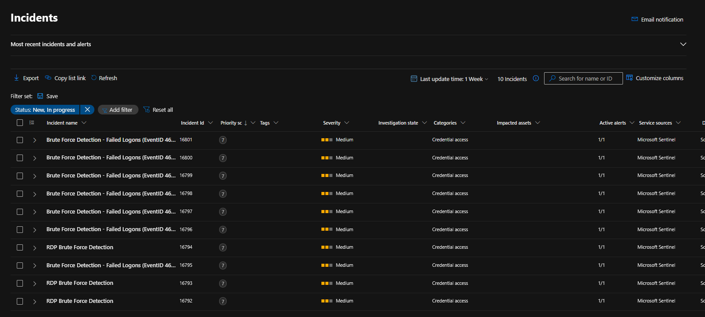
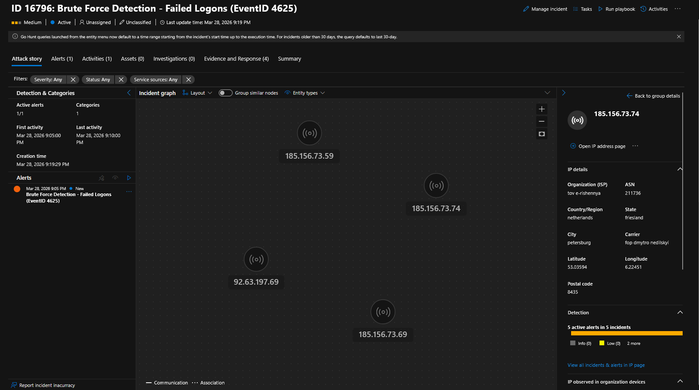
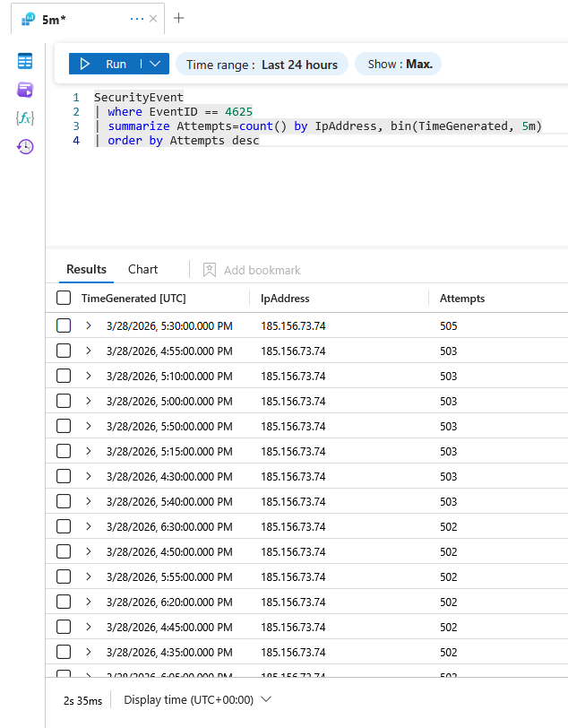
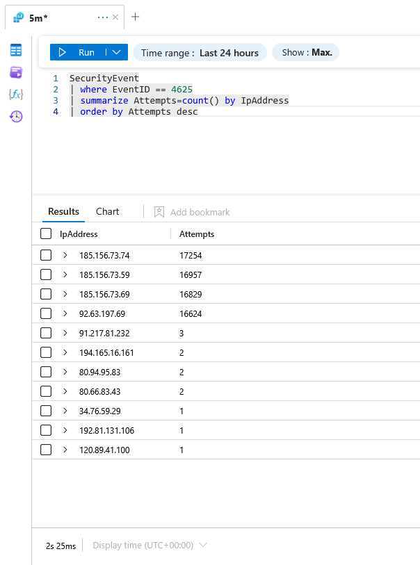
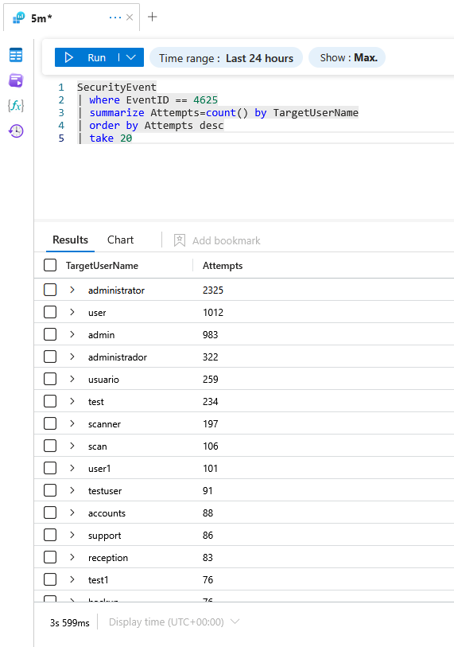
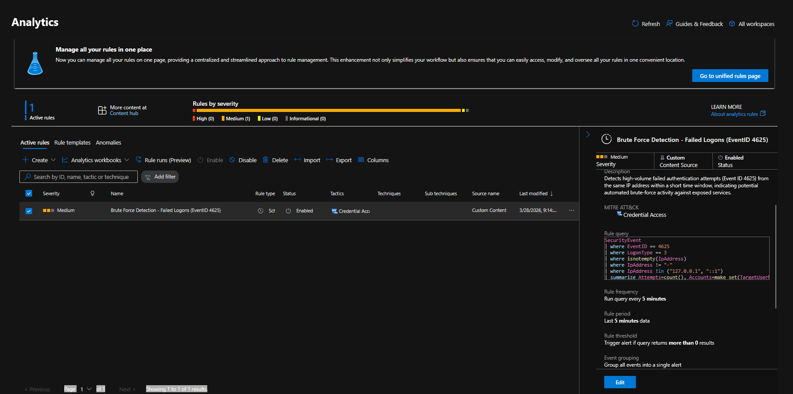

# Azure Sentinel Honeypot Lab


## Overview
Deployed intentionally exposed Windows VM in Azure to attract and analyze real-world attacks.

## Setup
- Windows VM in Azure with all ports open (NSG any/any)
- Microsoft Sentinel workspace configured
- Data Collection Rule (DCR) + Azure Monitor Agent (AMA) for log ingestion
- Windows Security Events data connector enabled
- Event ID 4625 (Failed Logon) monitored via custom KQL Analytic Rule

## Findings
- 70,000+ failed logon attempts in 24 hours
- 8 unique source IPs from 5 countries
- Primary attacker: Ukrainian organization using Netherlands VPS infrastructure
- Attack type: SMB brute force (Logon Type 3, NTLM authentication)
- Automated botnet: ~500 attempts per 5 minutes, consistent pattern

## Attacker Analysis
| IP | Country | AbuseIPDB Score | Attempts |
|---|---|---|---|
| 185.156.73.74 | Netherlands (UA org) | 38% | 17,254 |
| 185.156.73.59 | Netherlands (UA org) | 56% | 16,957 |
| 185.156.73.69 | Netherlands (UA org) | 65% | 16,829 |
| 92.63.197.69 | Netherlands (UA org) | 60% | 16,624 |
| 91.217.81.232 | Russia | 71% | 3 |
| 80.66.83.43 | Finland | 100% | 2 |
| 80.94.95.83 | Romania | 100% | 2 |
| 34.76.59.29 | Belgium | 100% | 1 |
| 192.81.131.106 | USA | 100% | 1 |
| 120.89.41.100 | Philippines  | 100% | 1 |

## Username Analysis
Top 5 targeted usernames revealed use of international credential stuffing wordlist:
- administrator (2,325 attempts)
- user (1012)
- admin (983)
- administrador (322) — Spanish variant confirms international wordlist
- usuario (259)

## Detection Engineering
Custom KQL Analytic Rule created in Microsoft Sentinel:
- Detects 50+ failed logons per 5 minutes from single IP
- Entity mapping for automated IP correlation
- Custom details: attempt count + username list per alert

## KQL Queries Used

### Brute Force Detection Rule
```kql
SecurityEvent
| where EventID == 4625
| where LogonType == 3
| where isnotempty(IpAddress)
| where IpAddress != "-"
| where IpAddress !in ("127.0.0.1", "::1")
| summarize Attempts=count(), Accounts=make_set(TargetUserName, 5) by IpAddress, bin(TimeGenerated, 5m)
| where Attempts >= 50
| order by Attempts desc
```

### Username Analysis
```kql
SecurityEvent
| where EventID == 4625
| summarize Attempts=count() by TargetUserName
| order by Attempts desc
| take 20
```
## Tools Used
- Microsoft Azure
- Microsoft Sentinel
- KQL (Kusto Query Language)
- AbuseIPDB
- VirusTotal

## Lessons Learned
- Strong password policy blocked 70,000+ attempts completely
- Automated botnets scan Azure IPs within hours of deployment
- Geolocation inconsistency between tools — infrastructure ≠ operator origin

Future improvements: Logic App integration for automatic IP geolocation via external API
Note: Azure Log Analytics workspace does not support geo_info_from_ip_address() function. Country mapping was done manually based on IP geolocation lookup via AbuseIPDB and VirusTotal.
## Screenshots

### Sentinel Incidents — 10 automated incidents generated


### Incident Graph & IP Details — Ukrainian infrastructure identified


### Attack Pattern — Automated botnet (~500 attempts/5min)


### IP Overview — Attackers from 5 countries


### Username Analysis — International credential stuffing wordlist


### Analytic Rule — Custom KQL detection rule



